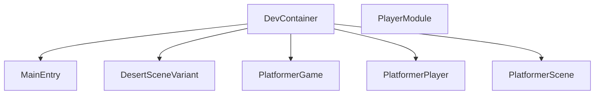

## 1. Stack
- Language: C (single-file programs, no headers except player.h/player.c).
- Graphics: OpenGL + GLUT — `<GLUT/glut.h>` on non-Windows, `<windows.h>` + `<GL/glut.h>` on Windows (main.c:1-6).
- Libs used in main.c: `math.h`, `stdlib.h`; linked against `-lglut -lGLU -lGL` (README.md:41).
- Build: direct `gcc` invocation — no manifest, no Makefile, no build-system file found at REPO_ROOT.
- Dev environment: Docker via `.devcontainer/` (VS Code Dev Containers extension), GUI served over noVNC (README.md).

## 2. Directory map
| path | what lives there |
|---|---|
| main.c | Desert scene GLUT program — documented entry point (README.md build command) |
| desert_scene.c | Separate desert-scene source; own prebuilt binary `desert_scene` (not read) |
| platformer_game.c | Separate platformer-game source; prebuilt binary `platformer_game` (not read) |
| platformer_player.c | Separate platformer-player source; prebuilt binary `platformer_player` (not read) |
| platformer_scene.c | Separate platformer-scene source (no matching prebuilt binary seen; not read) |
| player.c / player.h | Paired implementation + header, likely a shared module (not read) |
| *.png | Reference/screenshot images (desert_scene_now.png, desert_scene_screenshot.png, drawGround_explained.png, tumbleweed_closeup.png) |
| main / desert_scene / platformer_app / platformer_game / platformer_player | Prebuilt binaries checked into repo root |
| plan.md | Present at root; not read (out of the READ scope for this pass) |
| README.md | Devcontainer setup + build/run instructions |
| .devcontainer/ | Dockerfile, devcontainer.json, start-vnc.sh — dev container config (contents not read; out of scope) |

## 3. Diagram

## 4. Component index
- [[DevContainer]]
- [[MainEntry]]
- [[DesertSceneVariant]]
- [[PlatformerGame]]
- [[PlatformerPlayer]]
- [[PlatformerScene]]
- [[PlayerModule]]

## 5. Entry points
- Dev: open repo in VS Code → "Dev Containers: Reopen in Container" (`.devcontainer/devcontainer.json`) → noVNC tab / `http://localhost:6080/vnc.html` (README.md:36-39).
- Build+run (documented, main.c only): `gcc main.c -o app -lglut -lGLU -lGL && ./app`, run inside the container terminal (README.md:41).
- Other .c files (desert_scene.c, platformer_game.c, platformer_player.c, platformer_scene.c): no build command documented in README.md — TODO: verify.

## 6. Conventions (observed in main.c only)
- Section banners: `/* ===... TITLE ... === */` block comments dividing the file into Sky / Mountains / Ground / "putting it together" (main.c).
- Draw helpers named `drawX()` (drawRect, drawEllipse, drawSky, drawSun, drawCloud, drawMountain, drawGround, drawCactus, drawTumbleweed, drawSkull, …) (main.c).
- Static globals prefixed `g` (gTime, gPaused) (main.c:17-18).
- Platform branch for GLUT include path: `#ifdef _WIN32 ... #else ... #endif` at top of file (main.c:1-6).
- glPushMatrix/glPopMatrix wrap any drawX() that translates/rotates (drawSun, drawTumbleweed) (main.c).

## 7. Where things go
- New desert-scene decoration: add a `drawX()` helper in main.c beside the existing draw* functions, then call it from `display()` (main.c:481-544).
- Change animation speed/timing: edit `tick()` (gTime step, sunAngle) and the `glutTimerFunc` interval (main.c:546-559).
- New standalone GLUT program: add a new `.c` file at REPO_ROOT (repo is flat, no src/) mirroring main.c's init/display/reshape/keyboard/main structure, then add its `gcc` build line to README.md.
- Change dev/build environment: edit `.devcontainer/Dockerfile` or `.devcontainer/devcontainer.json` — TODO: verify contents (not read this pass).
